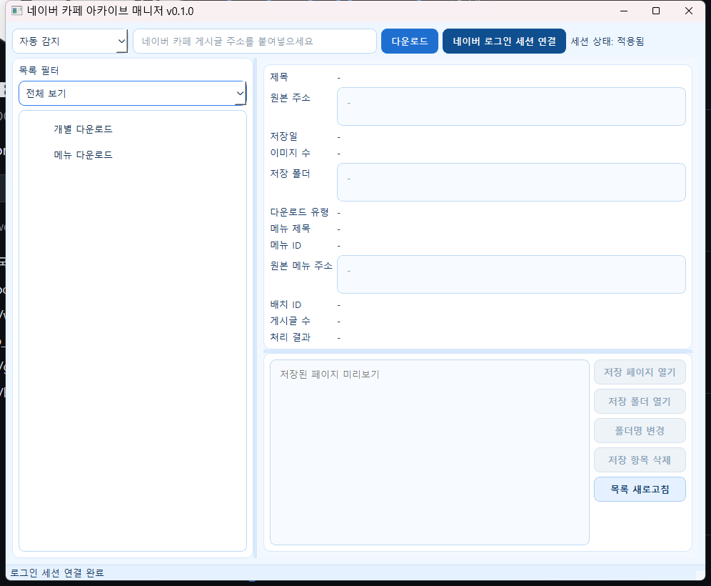
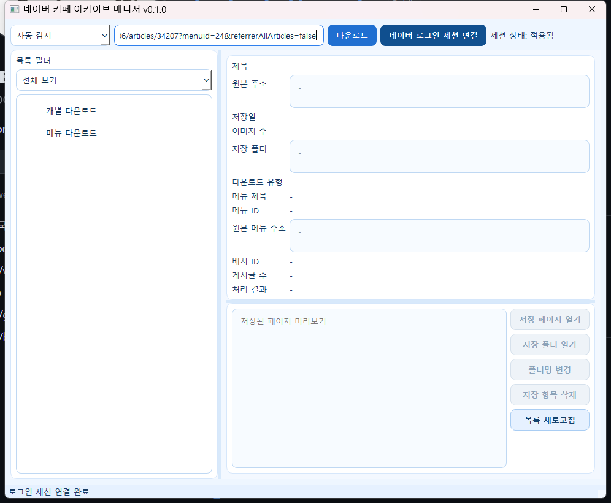
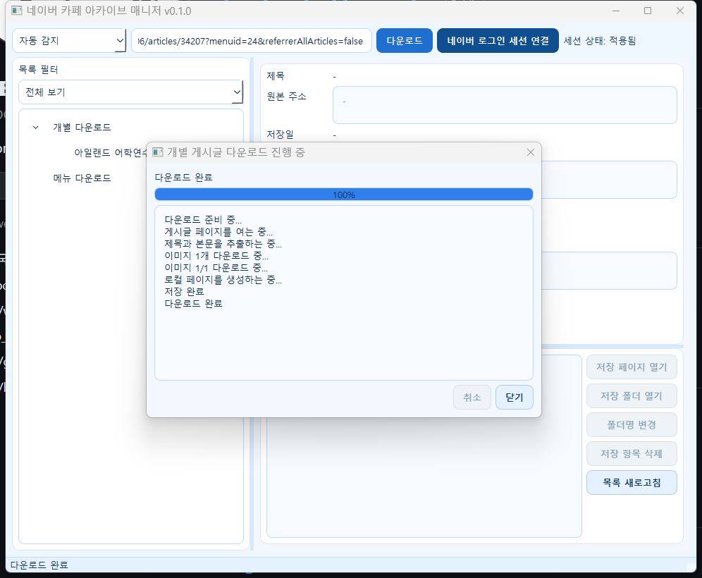
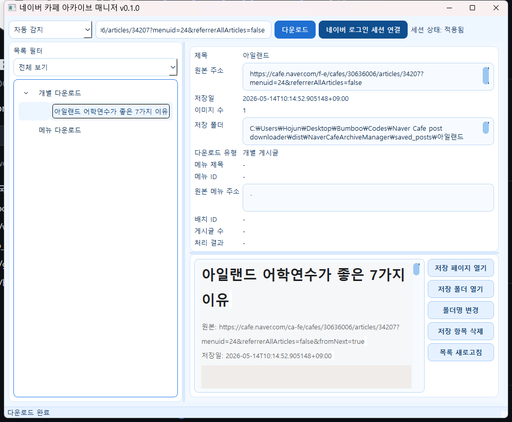
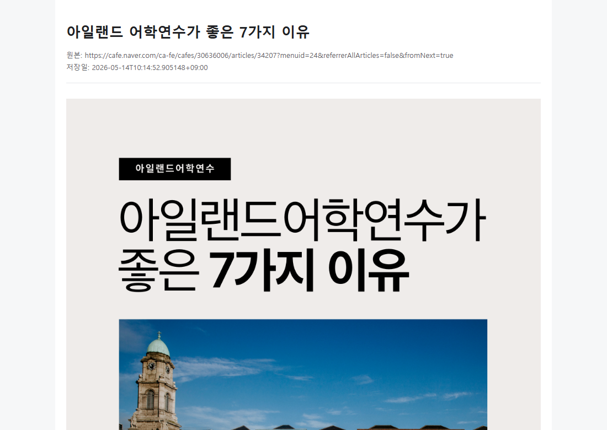

# 네이버 카페 아카이브 매니저

네이버 카페 게시글을 사용자의 PC에 저장해 로컬에서 관리하고 다시 열어볼 수 있게 도와주는 Windows 데스크톱 앱입니다.

## 주요 기능

- 네이버 카페 개별 게시글 다운로드
- 네이버 카페 메뉴/게시판 게시글 일괄 다운로드
- 게시글 제목, 본문 텍스트, 본문 HTML, 이미지 저장
- 저장된 게시글 목록 관리
- 저장된 로컬 페이지 열기
- 저장 폴더 열기
- 폴더명 변경
- 저장 항목 삭제
- 네이버 로그인 세션 연결
- 다운로드 진행 상태 표시 및 취소

## 개인정보 및 책임 안내

이 앱은 사용자의 로컬 PC에서 실행되는 도구입니다.

- 개발자 및 배포자는 사용자의 로컬 파일에 접근할 권한이 없습니다.
- 개발자 및 배포자는 사용자의 네이버 로그인 정보, 쿠키, 세션, 저장된 게시글, 이미지, 다운로드 기록을 수집하지 않습니다.
- 로그인 세션과 저장된 게시글은 사용자의 PC 안에 있는 `data/`, `saved_posts/` 폴더에만 저장됩니다.
- 앱은 네이버 비밀번호를 저장하지 않습니다.
- 사용자가 직접 로그인한 네이버 세션에서 볼 수 있는 카페 글만 저장합니다.
- 카페 접근 권한, 멤버 등급, 비공개 글 제한을 우회하지 않습니다.
- 저장된 파일, 로그인 세션, 압축 파일 공유로 인해 발생하는 개인정보 노출 책임은 사용자에게 있습니다.
- 다른 사람에게 프로그램을 공유할 때는 본인이 사용한 `data/`, `saved_posts/` 폴더를 포함하지 마세요.

배포용 ZIP 파일에는 개발자의 로그인 세션이나 저장된 게시글이 포함되어 있지 않습니다.
## Demo Walkthrough

실제 데모는 네이버 로그인 세션을 연결한 뒤, 카페 게시글 URL을 입력하고 로컬 저장 결과를 확인하는 흐름입니다.

1. `dist\NaverCafeArchiveManager\NaverCafeArchiveManager.exe`를 실행합니다.
2. `네이버 로그인 세션 연결`을 누르고 브라우저에서 직접 로그인합니다.
3. 앱 상단에 `세션 상태: 적용됨`이 보이면 게시글 URL을 입력합니다.
4. `다운로드` 버튼을 누릅니다.
5. 진행 창에서 게시글 열기, 본문 추출, 이미지 다운로드, 로컬 페이지 생성 단계를 확인합니다.
6. `다운로드 완료`가 보이면 왼쪽 목록에서 저장된 게시글을 선택합니다.
7. 오른쪽 미리보기와 `저장 페이지 열기`로 로컬 저장 결과를 확인합니다.

